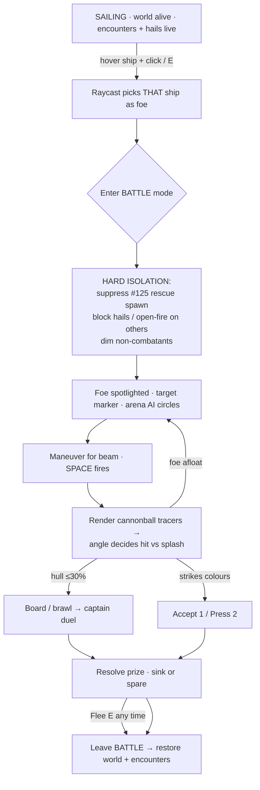
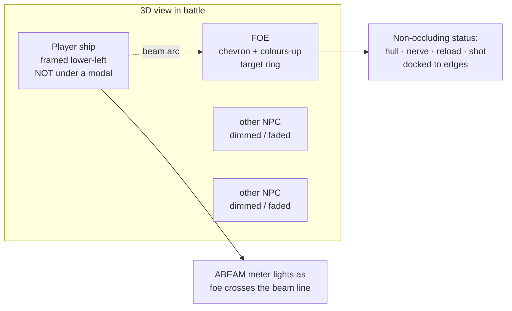

# Battle isn't fun yet — root-cause & buildable fix plan

**Source:** PM desk · owner feedback `2026-07-01` on the marquee battle lane ([#135](https://github.com/cakuki/tidewake/issues/135)) · Game Designer + Tech Lead pass
**Related:** [#135](https://github.com/cakuki/tidewake/issues/135) (battle epic) · [#95](https://github.com/cakuki/tidewake/issues/95) (mode system) · [#125](https://github.com/cakuki/tidewake/issues/125) (foundering encounter) · [#80](https://github.com/cakuki/tidewake/issues/80) (juice pass) · [#33](https://github.com/cakuki/tidewake/issues/33) (insult duel) · [#59](https://github.com/cakuki/tidewake/issues/59) (cannon broadside)

## Owner's words (verbatim)
> "Fights are not fun :( There are some sound effects but the popup covers my ship and I cannot see my ship in action. Also while moving other ships are all around: I don't know which one I am fighting with! And ship rescue choice can interfere the battle. In ship battle mode nothing else should interfere, we should see the cannon balls, the angles should matter. Also interacting with other ships should be hovering on the ship in the view, not like a HUD element."

---

## TL;DR diagnosis
The battle **model** is deep and correct — real-time abeam broadsides, a shot locker, hull→boarding→duel couplings, an arena-foe AI that circles you. The problem is that **almost none of it is legible in the 3D view.** The fight is fought in a **center-screen DOM modal that sits directly on top of the ship**, the foe is **visually indistinguishable** from the background traffic, the broadside is **pure math + a camera kick with no rendered projectile**, and **battle mode never actually isolates itself** — the [#125](https://github.com/cakuki/tidewake/issues/125) rescue encounter keeps spawning and stealing input mid-fight. In short: we built the *systems* of a battle and skipped the *staging* of one. Every complaint traces to a **rendering / presentation gap, not a mechanics gap** — which is good news: the fixes are mostly additive world-space rendering plus a few gates, with almost no change to the tested pure model.

---

## Per-thread root cause → fix

### Thread 1 — UI occlusion: the popup covers the ship
**Root cause (code):** The battle panel is a dead-center modal. In [`index.html`](https://github.com/cakuki/tidewake/blob/main/index.html) the `#battle` rule is `position: fixed; left: 50%; top: 50%; transform: translate(-50%, -50%)` (same for `#cannons`, `#duel`, `#encounter`). The camera in [`battle-camera` (main.js)](https://github.com/cakuki/tidewake/blob/main/src/main.js) frames the ship *dead center* (`quarterViewPos` in [`src/systems/battle.js`](https://github.com/cakuki/tidewake/blob/main/src/systems/battle.js) with `camera.lookAt(ship…)`), so the modal lands exactly on the subject it's describing. Every stat the player wants (hull bars, ABEAM cue, reload, shot type) is rendered by `renderBattle` in [`src/hud.js`](https://github.com/cakuki/tidewake/blob/main/src/hud.js) into that center card.
**Fix:** Convert the battle HUD from a center **modal** into a **non-occluding frame**: dock the hull/morale/reload/ammo readouts to a bottom-strip + corner cluster, keep the screen center empty for the ship. The `flashBanner` toast (`#toast`, `top: 64px`) is already off-center and fine; the offender is the persistent `#battle` card. Optionally offset the quarter-view camera framing so the ship sits lower-left, leaving upper-right for a compact status cluster.

### Thread 2 — Target ambiguity: which ship am I fighting?
**Root cause (code):** The foe is chosen by nearest-in-range index and handed to the arena AI ([`arenaHelm` in npc-ai.js](https://github.com/cakuki/tidewake/blob/main/src/npc-ai.js), wired via the `arena` object in the `npcs` system of [main.js](https://github.com/cakuki/tidewake/blob/main/src/main.js)), but **every other NPC keeps sailing normally** and there is **zero visual distinction** between the foe and the crowd. [`src/npc.js`](https://github.com/cakuki/tidewake/blob/main/src/npc.js) builds each ship with plain per-hull materials — no highlight, outline, or dim path exists. Nothing marks `battle.state.foeIndex` in world space.
**Fix:** In battle mode, **spotlight the foe and suppress non-combatants**: a world-space target marker over the foe (floating chevron / ring / colours-up flag), plus dim or fade the other NPCs (lower opacity / desaturate / hide beyond a radius). `foeIndex` is already on the snapshot — this is purely a render-side treatment keyed off it.

### Thread 3 — Mode isolation broken: rescue + hails leak into battle
**Root cause (code):** Battle mode does **not** gate the world's other interactions. In [main.js](https://github.com/cakuki/tidewake/blob/main/src/main.js) the `mode` system sets `f.deliberateStance = battle.state.active …` and therefore `f.paused = false` (the helm stays live to maneuver). The `encounter` system then calls `encounter.update(f.dt, { canSpawn: !f.paused })` — so **`canSpawn` is `true` during battle** and a [#125](https://github.com/cakuki/tidewake/issues/125) founderer ([`src/systems/encounter.js`](https://github.com/cakuki/tidewake/blob/main/src/systems/encounter.js)) can heave into view mid-fight, adding a third ship to the scene AND lighting a choice panel. The `keydown` handler checks `encounter.state.active` for the `1`/`2` keys, and `f`/`g` still fall through to `duel.tryChallenge()` / `cannons.openFire()` on other NPCs while the deliberate stance is held.
**Fix:** Make battle a **hard-isolated mode**. Gate `encounter.update`'s `canSpawn` (and any founderer despawn/present logic) on `!battle.state.active`; suppress a live founderer's render + choice panel while engaged (or defer the spawn). In `keydown`, short-circuit the encounter/hail/open-fire branches while `battle.state.active` so only battle verbs (SPACE/X/F-board/E-flee/1-2 surrender) are live. Nothing else should update, spawn, prompt, or claim input in battle.

### Thread 4 — Missing visual feedback: no cannonballs, angle doesn't visibly matter
**Root cause (code):** `resolveBroadside` in [`src/cannons.js`](https://github.com/cakuki/tidewake/blob/main/src/cannons.js) is **pure math + return values**; `battleFireJuiced` in [main.js](https://github.com/cakuki/tidewake/blob/main/src/main.js) adds only a **camera kick + a full-screen hull flash** ([`src/systems/juice.js`](https://github.com/cakuki/tidewake/blob/main/src/systems/juice.js), the [#80](https://github.com/cakuki/tidewake/issues/80) pass). There is **no projectile mesh, no muzzle flash, no impact spark anywhere** in the codebase (grep: none). The aim quality (`broadsideAim` → `quality`/`inArc` in [`src/systems/battle.js`](https://github.com/cakuki/tidewake/blob/main/src/systems/battle.js)) is real and drives damage, but it is surfaced **only as a text word** ("ABEAM") in the HUD — the player never *sees* the angle mattering.
**Fix:** Render the shot: spawn short-lived **cannonball tracers** from the firing broadside toward the foe on `fire()`, a **muzzle puff** at the gunports, and a **hit spark / splash** at the foe (hit) or in the water (wide, when `!inArc`). This is what makes "the angles matter" *visible* — a wide shot literally sails past. Cheap, pooled meshes; driven by the volley result already returned.

### Thread 5 — Diegetic interaction: hover the ship, not a HUD element
**Root cause (code):** All targeting is **proximity + keypress**: `nearestInRange()` in [`src/systems/battle.js`](https://github.com/cakuki/tidewake/blob/main/src/systems/battle.js) and [`src/cannons.js`](https://github.com/cakuki/tidewake/blob/main/src/cannons.js), engaged via `e`/`f`/`g` in [main.js](https://github.com/cakuki/tidewake/blob/main/src/main.js). There is **no `THREE.Raycaster` and no `pointermove` hit-test against ships** (grep: `pointermove` exists only for camera-orbit in [`src/input.js`](https://github.com/cakuki/tidewake/blob/main/src/input.js)). You engage "whatever's nearest," never "that ship there."
**Fix:** Add a **cursor raycast** against NPC hulls: hover a ship → world-space highlight + a small diegetic label; click → engage *that* ship. `engage()` takes the nearest index today; generalize it to accept a chosen index so the raycast picks the foe. Keeps the keyboard path as a fallback.

---

## Desired battle-mode isolation / interaction flow

## Target-lock + camera-framing concept

---

## Prioritised buildable slice list

| # | Slice | Player-facing win | Scope | Files | Risk |
|---|-------|-------------------|-------|-------|------|
| 1 | **Non-occluding battle UI** | "I can see my ship fight — stats are at the edges, not on top of it." | S | [`index.html`](https://github.com/cakuki/tidewake/blob/main/index.html) (`#battle`/`#cannons` CSS), [`src/hud.js`](https://github.com/cakuki/tidewake/blob/main/src/hud.js) (`renderBattle` layout) | Low — CSS/DOM only, no model change |
| 2 | **Hard mode isolation** | "In a fight, nothing else pesters me — no rescue popups, no stray hails." | S | [`src/main.js`](https://github.com/cakuki/tidewake/blob/main/src/main.js) (`encounter` system `canSpawn`, `keydown` gates), [`src/systems/encounter.js`](https://github.com/cakuki/tidewake/blob/main/src/systems/encounter.js) | Low — gating; add a regression test that no founderer spawns while `battle.active` |
| 3 | **Target lock: foe highlight + dim non-combatants** | "I always know which ship I'm fighting." | M | [`src/npc.js`](https://github.com/cakuki/tidewake/blob/main/src/npc.js) (highlight/dim material path), [`src/main.js`](https://github.com/cakuki/tidewake/blob/main/src/main.js) (drive off `foeIndex`), a small world-space marker | Med — touches NPC render; keep behind battle-active flag |
| 4 | **Rendered cannonballs + tracers + hit sparks** | "I see the volley fly — and a wide shot splashes past." | M | new projectile/FX module, [`src/main.js`](https://github.com/cakuki/tidewake/blob/main/src/main.js) (spawn on `battleFireJuiced`), reuse [`src/systems/juice.js`](https://github.com/cakuki/tidewake/blob/main/src/systems/juice.js) timing | Med — perf budget ([#52] draw-call gate); pool meshes |
| 5 | **Aim-angle feedback** | "The angle visibly matters — the beam line lights as she crosses it." | S | [`src/hud.js`](https://github.com/cakuki/tidewake/blob/main/src/hud.js) + a world-space beam/arc gizmo; reads `broadsideAim` in [`src/systems/battle.js`](https://github.com/cakuki/tidewake/blob/main/src/systems/battle.js) | Low — read-only off existing `quality`/`inArc` |
| 6 | **Hover-to-interact (raycast ship under cursor)** | "I point at a ship to pick my fight." | M | [`src/input.js`](https://github.com/cakuki/tidewake/blob/main/src/input.js) or new picker, [`src/main.js`](https://github.com/cakuki/tidewake/blob/main/src/main.js) (`THREE.Raycaster`), generalize `engage(index)` in [`src/systems/battle.js`](https://github.com/cakuki/tidewake/blob/main/src/systems/battle.js) | Med — pointer already used for camera drag; disambiguate click vs orbit |

---

## Recommended sequence & lane call
**Sequence: 2 → 1 → 3 → 4 → 5 → 6.** Do **isolation (2) first** — it's the cheapest, it's the one actively-broken *correctness* bug (input theft / a third ship in the arena), and it makes every later slice testable in a clean stage. Then **1 (uncover the ship)** and **3 (name the foe)** — together those two make the fight *legible*, which is the core of "not fun." **4 + 5** make it *feel* like gunnery (see the ball, see the angle). **6** is the diegetic polish the owner wants but depends on a clean, isolated, legible stage first.

**Lane call: YES — open a focused "Make Battle Fun" sub-lane that preempts new battle *mechanics*.** The owner's verdict after ~20 loops is that the marquee feature reads as not-fun, and the gap is entirely **staging/legibility, not depth**. We should freeze new mechanical slices (no Option-4 deepening, no new ammo) until slices 1–5 land, because more mechanics on an illegible stage compound the problem. This is a presentation-hardening lane on top of [#135](https://github.com/cakuki/tidewake/issues/135), squarely in the spirit of the [#80](https://github.com/cakuki/tidewake/issues/80) game-feel pass.

**Highest-impact first slice:** **Slice 2 (Hard mode isolation)** — it fixes the only thread that is an outright bug (the rescue/hail interference the owner explicitly called out), is scope-S, and unblocks clean testing of the rest. If you'd rather lead with the most *visible* win, **Slice 1 (non-occluding UI)** is the closest second — one CSS/layout change that immediately answers "the popup covers my ship."

---

## Open questions for the owner
1. **Camera intent:** keep the current auto quarter-view (ship framed, foe off the quarter), or do you want a freer battle camera you can swing to keep both ships in frame?
2. **Non-combatants in battle:** fully **hide** other NPCs during a fight, or keep them faintly visible (dimmed) so the sea still feels alive around the duel?
3. **Cannonball fidelity:** stylized arcing tracers with splashes (cheap, arcade, reads instantly), or a more sim-flavoured flat-trajectory shot? (Affects perf budget and the "angles matter" read.)
4. **Hover-to-interact reach:** should cursor-hover engagement apply only in/around battle (pick your foe), or everywhere at sea (hover any ship to hail/trade/fight) as a general diegetic-interaction shift away from HUD verbs?

---

## Sources
- [`src/systems/battle.js`](https://github.com/cakuki/tidewake/blob/main/src/systems/battle.js) — engagement controller, `quarterViewPos`, `broadsideAim`, `nearestInRange`, `foeIndex`
- [`src/cannons.js`](https://github.com/cakuki/tidewake/blob/main/src/cannons.js) — `resolveBroadside` (pure math + SFX; no projectile)
- [`src/systems/board.js`](https://github.com/cakuki/tidewake/blob/main/src/systems/board.js) · [`src/systems/ammo.js`](https://github.com/cakuki/tidewake/blob/main/src/systems/ammo.js) — boarding/duel couplings, shot locker (deep model, working)
- [`src/main.js`](https://github.com/cakuki/tidewake/blob/main/src/main.js) — `mode`/`encounter`/`npcs` systems, `battle-camera`, `keydown` fork, `battleFireJuiced`
- [`src/systems/encounter.js`](https://github.com/cakuki/tidewake/blob/main/src/systems/encounter.js) — [#125](https://github.com/cakuki/tidewake/issues/125) founderer, spawns while `!f.paused` (i.e. during battle)
- [`src/npc.js`](https://github.com/cakuki/tidewake/blob/main/src/npc.js) · [`src/npc-ai.js`](https://github.com/cakuki/tidewake/blob/main/src/npc-ai.js) — per-hull materials (no highlight/dim), `arenaHelm` foe AI
- [`src/hud.js`](https://github.com/cakuki/tidewake/blob/main/src/hud.js) · [`index.html`](https://github.com/cakuki/tidewake/blob/main/index.html) — `renderBattle`; `#battle`/`#cannons`/`#duel`/`#encounter` all `translate(-50%,-50%)` center modals
- [`src/systems/juice.js`](https://github.com/cakuki/tidewake/blob/main/src/systems/juice.js) — [#80](https://github.com/cakuki/tidewake/issues/80) camera kick + flash (feedback exists, but no world-space projectile)
- [`src/input.js`](https://github.com/cakuki/tidewake/blob/main/src/input.js) — `pointermove` used only for camera orbit (no ship raycast)
