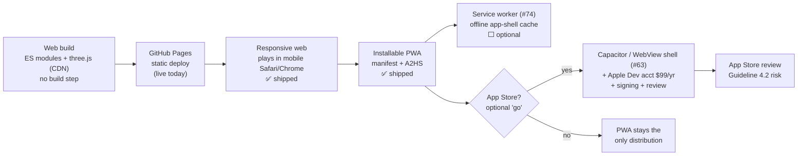
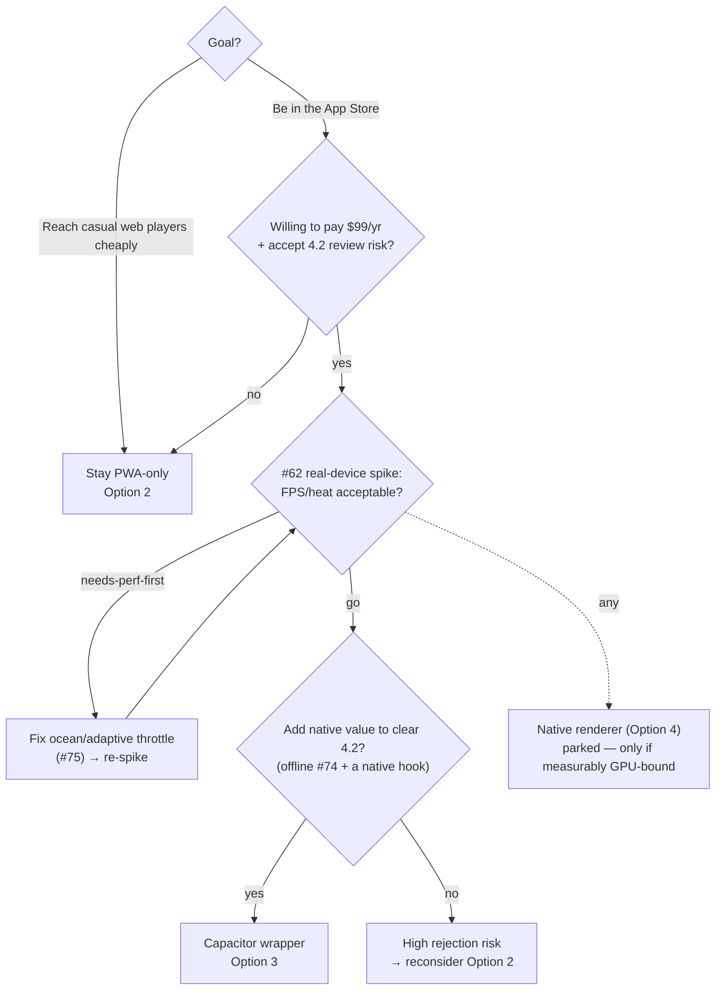

# Owner brief — Mobile & iOS support

_Tech Lead + Game Designer discovery pass · 2026-07-01_

## TL;DR

- You are **already shipped** on "installable-on-iPhone." The mobile MVP — installable PWA ([`manifest.webmanifest`](https://github.com/cakuki/tidewake/blob/main/manifest.webmanifest)), touch controls, a rotatable **ship's-wheel** helm ([`src/ui/wheel.js`](https://github.com/cakuki/tidewake/blob/main/src/ui/wheel.js)), safe-area insets, and a heat-aware DPR cap — landed in `v0.0.20260627131832` and closed [#63](https://github.com/cakuki/tidewake/issues/63) and [#93](https://github.com/cakuki/tidewake/issues/93).
- What's left is **two separate, optional decisions**, not one big build: (a) **polish + de-risk** the web/PWA experience on real phones ([#62](https://github.com/cakuki/tidewake/issues/62), [#74](https://github.com/cakuki/tidewake/issues/74), [#75](https://github.com/cakuki/tidewake/issues/75)); and (b) **the App Store**, which is a WebView-wrapper decision ([#63](https://github.com/cakuki/tidewake/issues/63) approach) carrying a real Apple **Guideline 4.2 "minimum functionality" rejection risk** plus a **$99/yr** fee and review overhead.
- Recommendation: **stay on the PWA track, run the [#62](https://github.com/cakuki/tidewake/issues/62) real-device spike first**, and treat the App Store as a deliberate later "go" — not a default.

---

## Where we are today

**Already works on mobile (shipped):**

| Capability | Evidence |
|---|---|
| Responsive / no-clip viewport, mobile-viewport playtest guard | [#66](https://github.com/cakuki/tidewake/issues/66), [#146](https://github.com/cakuki/tidewake/issues/146) — device-width viewport asserted in [`tests/unit/pwa.test.mjs`](https://github.com/cakuki/tidewake/blob/main/tests/unit/pwa.test.mjs) |
| **Installable PWA** — `display: standalone`, add-to-home-screen, brass-anchor icons, sunny theme | [`manifest.webmanifest`](https://github.com/cakuki/tidewake/blob/main/manifest.webmanifest) + `apple-mobile-web-app-*` meta in [`index.html`](https://github.com/cakuki/tidewake/blob/main/index.html) |
| **Touch controls** — on-screen throttle/steer/duel that synthesise the existing keydown surface (no parallel physics path) | [`src/input.js`](https://github.com/cakuki/tidewake/blob/main/src/input.js) (#17) |
| **Ship's-wheel helm** — drag-to-steer analog widget in a fixed control zone; self-centring; does not fight camera-orbit | [`src/ui/wheel.js`](https://github.com/cakuki/tidewake/blob/main/src/ui/wheel.js) ([#93](https://github.com/cakuki/tidewake/issues/93)) |
| **Safe-area insets** — top HUD / corners / touch clusters use `env(safe-area-inset-*)` | [`index.html`](https://github.com/cakuki/tidewake/blob/main/index.html) CSS |
| **Heat-aware perf cap** — pixel-ratio clamped to **1.5×** on coarse-pointer devices; `powerPreference: 'high-performance'` | `DPR_CAP_TOUCH` in [`src/perf.js`](https://github.com/cakuki/tidewake/blob/main/src/perf.js), renderer in [`src/main.js`](https://github.com/cakuki/tidewake/blob/main/src/main.js) |

**Perf headroom is healthy.** Budget ceilings are **130 draw calls / 150k triangles** ([`src/perf.js`](https://github.com/cakuki/tidewake/blob/main/src/perf.js)); measured scene cost is **~77 draws / ~85k tris** (headless 1280×800, sailing) — roughly 70% headroom. These are GPU-independent renderer counters, so they gate CI reliably but do **not** tell us real-phone FPS/heat. That's exactly the unknown [#62](https://github.com/cakuki/tidewake/issues/62) exists to retire.

**Still missing:**

- **Real-device numbers** — no measured FPS/thermal/thumb-reach data from actual phones yet ([#62](https://github.com/cakuki/tidewake/issues/62), still open).
- **Offline / service worker** — none exists; the app also imports `three` from a CDN, so true offline needs caching or vendoring ([#74](https://github.com/cakuki/tidewake/issues/74), open, P3).
- **Landscape + low-end polish** — portrait is verified; landscape crowding, a full safe-area sweep, and an **adaptive** perf step-down (vs today's static 1.5× cap) are pending ([#75](https://github.com/cakuki/tidewake/issues/75), open, P3). The per-vertex Gerstner ocean shader remains the prime low-end risk.
- **App Store presence** — nothing packaged; no Apple Developer account.

---

## Delivery pipeline

---

## The options

| Option | Player reach | Scope | Cost ($ + effort) | Risk | Codebase impact |
|---|---|---|---|---|---|
| **1. Responsive web (do nothing more)** | Anyone with a mobile browser, via URL | — (shipped) | $0 | Low. Discovery/retention only (no home-screen icon beyond manual A2HS) | None |
| **2. Installable PWA** (mostly shipped; polish = [#74](https://github.com/cakuki/tidewake/issues/74) SW + [#75](https://github.com/cakuki/tidewake/issues/75)) | Same reach + home-screen icon, standalone chrome, optional offline | **S–M** (install already done; SW + landscape/low-end polish remain) | $0. S/M effort | Med: SW is the classic "why isn't my fix live" footgun on a fast release cadence — must be **release-tag-versioned + self-invalidating** ([#74](https://github.com/cakuki/tidewake/issues/74)). iOS caps PWA cache ~50 MB and evicts unused data | Additive: one `sw.js`, decide CDN-`three` caching/vendoring; CSS polish |
| **3. App Store via Capacitor/WebView wrapper** ([#63](https://github.com/cakuki/tidewake/issues/63) approach) | + App Store discovery & "real app" credibility | **S wrapper + M prerequisites** (touch/HUD already done) | **$99/yr Apple Dev** + signing + review cycles; S/M effort | **High-ish**: Apple **Guideline 4.2** may reject a thin web-in-WebView "web clipping"; iOS WebGL perf for the Gerstner ocean on low-end/high-DPR phones; WKWebView quirks (audio-unlock on gesture, viewport). Games often pass, but it's not guaranteed | Additive shell (Capacitor project loading the existing build); renderer reused 100% |
| **4. Native Swift/Metal renderer** | Same as App Store, best-case perf | **L+** | Very high effort; ongoing dual maintenance | Abandons the browser product per the CONSTITUTION | Full fork of the renderer — **parked/declined** ([#63](https://github.com/cakuki/tidewake/issues/63)) |

**On the App Store 4.2 risk (concrete):** current guidance is that a WKWebView that merely loads a website tends to be rejected as "minimum functionality"; wrappers that pass add genuine native value — **push notifications, native navigation/deep-linking, offline**. So if the App Store is a "go," budget for at least the [#74](https://github.com/cakuki/tidewake/issues/74) offline SW and one or two native hooks to clear review, not just a bare shell.

---

## Decision tree

---

## The Phase 0 spike ([#62](https://github.com/cakuki/tidewake/issues/62)) — measure before wrapping

Run the **live Pages build** (`https://cakuki.github.io/tidewake/`) on **2–3 real devices** — at least one low-end + one modern; **iOS Safari + Android Chrome; portrait _and_ landscape** — and capture:

- **FPS + frame-time** over a few minutes of sailing, via the `window.__tidewake` / `perf` hook ([`src/main.js`](https://github.com/cakuki/tidewake/blob/main/src/main.js), #52). Watch whether the per-vertex Gerstner ocean holds up.
- **Thermal behaviour** — does FPS decay as the phone heats? Does the device get hot to the touch in ~5 min? (No web thermal API on iOS — observe FPS decay + device warmth.)
- **Memory** — iOS Safari kills tabs at ~a few-hundred-MB to low-GB depending on device; confirm no reload-on-return. (WebGL context counts toward the page memory ceiling.)
- **Touch UX** — is the **ship's-wheel** thumb-reachable and readable? Do the wheel and **camera-orbit drag** coexist without fighting? Any HUD clipping under notch/home-indicator in either orientation?

**Go / no-go it informs:** `go` (numbers fine → PWA polish + optionally green-light a wrapper) · `needs-perf-first` (ocean/adaptive throttle work in [#75](https://github.com/cakuki/tidewake/issues/75) before any App Store spend) · `not-yet`. This is the cheapest way to retire the biggest unknown **before** paying Apple or building a shell.

---

## Recommended path (phased, minimal-first)

1. **Slice 1 — [#62](https://github.com/cakuki/tidewake/issues/62) real-device spike (½ day, $0).** Get FPS/heat/thumb-reach numbers. Smallest possible next step; gates everything below.
2. **Slice 2 — PWA polish if the spike flags it ([#75](https://github.com/cakuki/tidewake/issues/75)):** landscape pass, full safe-area sweep, and an **adaptive** perf step-down (drop DPR / reduce ocean detail when measured FPS stays low) replacing today's static 1.5× cap.
3. **Slice 3 — offline service worker ([#74](https://github.com/cakuki/tidewake/issues/74))** _only if_ offline is a real player need or you're heading to the App Store (it also helps clear 4.2). Must be release-tag-versioned + self-invalidating; keep the headless playtest green.
4. **Slice 4 — App Store, only on an explicit "go":** stand up a **Capacitor** project loading the live build, add the native value needed for 4.2, get the $99 Apple Dev account, sign, submit. Treat first review as a probe, not a guarantee.

The honest headline: **slices 1–2 are cheap and high-value; slice 4 is the real fork** — separate money, separate risk, and reversible only at the cost of review cycles.

---

## Open questions for the owner

1. **Reach vs storefront:** is the goal to reach **casual web players** (a URL is enough → Option 2), or specifically to **be in the App Store** (Option 3, with its cost/risk)?
2. **Apple commitment:** are you willing to pay **$99/yr** and absorb **Guideline 4.2 rejection risk** and review iteration for a WebView-wrapped game?
3. **Offline:** is playing with no/spotty connection a genuine player need (funds [#74](https://github.com/cakuki/tidewake/issues/74)), or nice-to-have? Note it doubles as 4.2 "native value."
4. **Perf gate:** if the [#62](https://github.com/cakuki/tidewake/issues/62) spike shows the Gerstner ocean struggling on low-end phones, do we **fix perf first** ([#75](https://github.com/cakuki/tidewake/issues/75)) or **ship anyway** with an adaptive quality drop?
5. **Touch-steering model:** keep the **ship's-wheel** helm as the primary steer, or also offer the [#75](https://github.com/cakuki/tidewake/issues/75) **gesture/tilt** alternative? (Wheel is shipped and on-theme; gesture is optional polish.)

---

## Sources

- [PWA iOS Limitations and Safari Support (2026) — MagicBell](https://www.magicbell.com/blog/pwa-ios-limitations-safari-support-complete-guide)
- [Do Progressive Web Apps Work on iOS? Complete Guide 2026 — MobiLoud](https://www.mobiloud.com/blog/progressive-web-apps-ios)
- [Publishing a PWA to the App Store — what works in 2026 — MobiLoud](https://www.mobiloud.com/blog/publishing-pwa-app-store)
- [PWABuilder iOS — App Store packaging README](https://github.com/pwa-builder/pwabuilder-ios/blob/main/README.md)
- [Building Progressive Web Apps — Capacitor Docs](https://capacitorjs.com/docs/web/progressive-web-apps)
- [Mobile Safari web pages are severely limited by memory — Lapcat Software](https://lapcatsoftware.com/articles/2026/1/7.html)
- [WebGL Performance on Safari — Wonderland Engine](https://wonderlandengine.com/news/webgl-performance-safari-apple-vision-pro/)
- [100 Three.js Tips That Actually Improve Performance (2026) — Utsubo](https://www.utsubo.com/blog/threejs-best-practices-100-tips)
- [Changing pixelRatio based on fps — three.js forum](https://discourse.threejs.org/t/changing-pixelratio-based-on-fps-good-or-bad-idea/34563)
