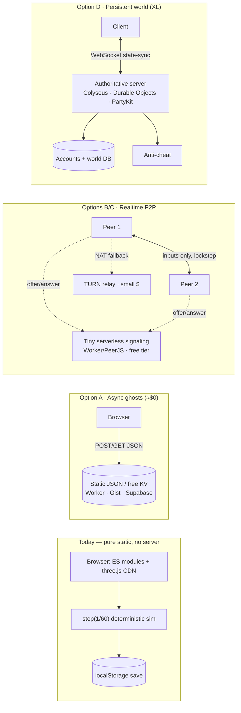
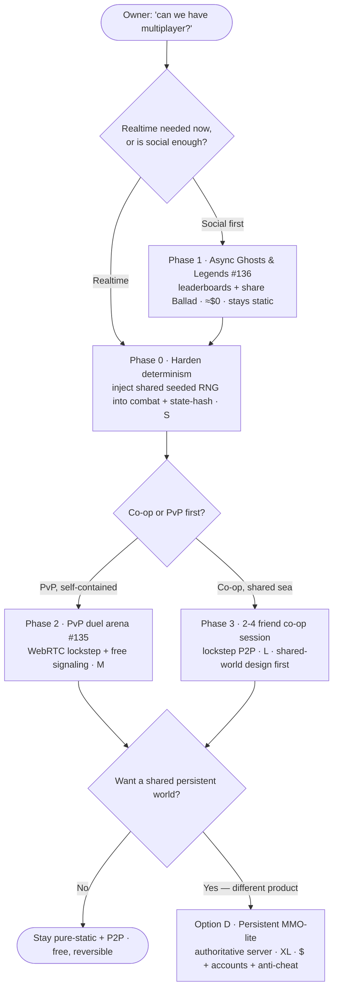

# Owner Brief — Online Multiplayer / Online Session ([#139](https://github.com/cakuki/tidewake/issues/139))

_Tech Lead + Game Designer discovery pass · 2026-07-01 · decision-oriented, no build yet._

## TL;DR

- Tidewake's simulation is **already most of the way to lockstep-ready**: a fixed-timestep `step(seconds)` hook, inputs modelled as a tiny set of held keys, and a **seeded** NPC RNG. That makes **P2P co-op / PvP over WebRTC the natural cheap realtime path** — no authoritative server required.
- But **"multiplayer" is four different products**, not one. The honest sequence is **async "ghosts & legends" first (≈$0, stays static)** → **consensual PvP duel** → optional **co-op** → and only if the owner wants a genuinely different game, a **persistent world (XL, one-way door, ongoing $ + accounts + anti-cheat)**.
- The one real engineering pre-req for _any_ realtime option is small and reversible: **make combat deterministic** by injecting a shared seeded RNG (the combat functions already accept an injectable `rng`).

---

## What "multiplayer" could actually mean here

Four scoped options, cheapest-first. Scope: **S** = days, **M** = ~1–2 weeks, **L** = ~1 month, **XL** = multi-month + ongoing ops.

| Option | Player-fantasy fit | Netcode model | Transport + hosting | Scope | $ / infra | Risk |
|---|---|---|---|---|---|---|
| **A. Async "Ghosts & Legends"** ([#136](https://github.com/cakuki/tidewake/issues/136)) — leaderboards of Infamy/Standing, share the Ballad, see other captains' ghost ships | **Strong** — "write your own legend" made social; compete without changing solo play | **None realtime.** Post/fetch JSON blobs; ghost = recorded input-stream + seed replayed via `step()` | Static JSON (read-only) _or_ tiny free KV store (Cloudflare Worker+KV, Gist API, Supabase table) | **S** | **$0–low.** Can stay pure-static if read-only | **Low** — reversible |
| **B. PvP ship battle** — challenge a friend to broadside → boarding → verbal duel ([#135](https://github.com/cakuki/tidewake/issues/135)) | **Strong** — direct payoff of the just-shipped battle; grows the pirate arc | **Deterministic lockstep** (2 players, arcade-tolerant of a few frames input delay) | **WebRTC DataChannel P2P** + tiny serverless signaling (Worker/PeerJS/p2pcf) | **M** | **~$0** signaling (free tier); optional TURN small $ | **Medium** — combat determinism + P2P trust |
| **C. Small co-op session** — 2–4 friends, one shared sea, private room | **Good, but design-heavy** — sailing together is lovely; "whose economy / ports / save?" is unsolved | **Deterministic lockstep** P2P (send inputs only, both run `step()`) | WebRTC P2P + signaling; host-migration risk | **L** | **~$0–low** signaling; TURN small $ | **Medium-High** — shared-world semantics + full-sim determinism |
| **D. Persistent world / MMO-lite** — many players, one living archipelago, persistent economy | **Tension** — turns a personal legend into a shared MMO; conflicts with the solo pillar | **Authoritative state-sync** + interpolation/snapshots | **WebSocket** to an authoritative backend (Colyseus / Durable Objects / PartyKit) | **XL** | **Ongoing $ + ops** + accounts + anti-cheat | **High — one-way door** |

---

## Architecture reality — what the codebase already gives us

Tidewake is a **no-build static site**: plain ES modules + `three@0.160.0` from the unpkg CDN (importmap in [`index.html`](https://github.com/cakuki/tidewake/blob/main/index.html)), deployed on **GitHub Pages with no server**. That constraint is the spine of this brief.

**Determinism — the single biggest netcode enabler — is largely already there:**

- **Fixed-timestep sim hook.** [`src/main.js`](https://github.com/cakuki/tidewake/blob/main/src/main.js) exposes `window.__tidewake.step(seconds)`, a `1/60` accumulator loop (`while (acc > 0) { dt = min(1/60, acc); update(dt) }`) — frame-rate independent. This is the exact tick boundary lockstep needs.
- **Inputs are already a tiny command surface.** [`src/input.js`](https://github.com/cakuki/tidewake/blob/main/src/input.js) reduces all control to a `Set` of held keys sampled by the sailing step, and the QA hook exposes `press`/`release`. That is essentially the input packet a lockstep peer would ship.
- **NPC fleet is seeded & deterministic.** [`src/npc.js`](https://github.com/cakuki/tidewake/blob/main/src/npc.js) uses a `mulberry32(0x7ea51de)` PRNG — a fixed fleet every run.

**The gap that must close for realtime (B/C):**

- **Combat resolution is non-deterministic today.** [`src/cannons.js`](https://github.com/cakuki/tidewake/blob/main/src/cannons.js), [`src/duel.js`](https://github.com/cakuki/tidewake/blob/main/src/duel.js) and [`src/systems/encounter.js`](https://github.com/cakuki/tidewake/blob/main/src/systems/encounter.js) default `rng = Math.random`. **Good news:** every one of these functions already takes an **injectable `rng` parameter**, so switching them to a shared seeded PRNG is a contained, low-risk change — not a rewrite.
- **Cosmetic randomness is fine.** The other ~40 `Math.random` calls (audio, wake, foam, colours) are render-only and never touch sim state — they can stay.
- **Cross-browser float determinism** is the residual lockstep risk (`Math.sin/cos` aren't guaranteed bit-identical across JS engines). Mitigate with a periodic **state-hash desync check** rather than chasing bit-perfection.

**Save / identity today:** [`src/persistence.js`](https://github.com/cakuki/tidewake/blob/main/src/persistence.js) is **localStorage only — single-player, no accounts, no server**. Async (A) needs only an anonymous handle; realtime (B/C) needs room/session ids; persistent world (D) needs real auth.

**One-way doors vs reversible bets:**

- **Reversible** (keep the no-infra ethos, rip out anytime): **A** (static/free KV) and **B/C** (P2P + optional free signaling; the sim stays authoritative on each client).
- **One-way door** (different product, permanent cost): **D** — authoritative infra, accounts, ops, and anti-cheat obligations that don't go away.

**Cheating/authority note:** P2P (B/C) is **trust-based** — there's no referee, so a determined peer can desync or manipulate. That's acceptable for **consensual duels/co-op with friends** (the natural first audience) but **not** for ranked/anonymous play, which is precisely what pushes you toward the authoritative server in D.

---

## Recommended path — minimal-first, each step earns the next

1. **Phase 0 — Harden determinism (S, reversible).** Inject one shared seeded PRNG into `cannons.js`/`duel.js`/`encounter.js` (they already accept `rng`); add a per-tick state-hash for desync detection. Unlocks _every_ realtime option and is worth doing regardless.
2. **Phase 1 — Async "Ghosts & Legends" ([#136](https://github.com/cakuki/tidewake/issues/136)) (S).** **The smallest viable first slice:** a leaderboard of Infamy/Standing + share-your-Ballad, backed by a tiny free key-value store (Cloudflare Worker+KV or a Gist), or fully static read-only JSON if the owner wants zero server. Grows the "your legend" fantasy with the least risk and cost. Ghost ships (replay recorded input+seed) are a natural stretch.
3. **Phase 2 — PvP duel arena (M).** Bounded, consensual, extends the just-shipped battle ([#135](https://github.com/cakuki/tidewake/issues/135)). WebRTC P2P lockstep + free serverless signaling + room codes. Most self-contained realtime slice because the arena is bounded, not the open sea.
4. **Phase 3 — Co-op session (L, optional).** Only after the shared-world design questions (whose economy/ports/save?) are answered.
5. **Defer Option D** unless the owner explicitly wants to build a different, larger product.

---

## Open questions for the owner (these actually branch the design)

1. **Realtime, or is social-async enough to start?** Async ghosts/leaderboards is ≈$0 and can stay static; realtime forces the determinism work + signaling.
2. **Co-op or PvP first for the realtime slice?** PvP is more self-contained and directly extends [#135](https://github.com/cakuki/tidewake/issues/135); co-op opens the harder "shared world" design.
3. **May we leave pure-static / add a small backend?** Even a free-tier Cloudflare Worker for signaling or a leaderboard crosses the "no server" line. Is a tiny free-tier service acceptable, or must it remain 100% static (which caps us at read-only ghost data)?
4. **Any budget / appetite for ongoing ops?** Free tiers cover small scale; TURN relay and a persistent world cost real money and maintenance forever.
5. **Identity — anonymous handles, or real accounts?** Anonymous is fine for A/B/C; real accounts + anti-cheat are mandatory for D.
6. **Does multiplayer serve the solo "your legend, your way" pillar, or is it a deliberate expansion?** Options A–C complement solo play; D partly replaces it.

---

## Sources

- Netcode models (lockstep vs rollback): [SnapNet — Lockstep](https://www.snapnet.dev/blog/netcode-architectures-part-1-lockstep/), [SnapNet — Rollback](https://www.snapnet.dev/blog/netcode-architectures-part-2-rollback/), [Meseta — Lockstep and Rollback](https://meseta.medium.com/netcode-concepts-part-3-lockstep-and-rollback-f70e9297271), [yal.cc — Preparing your game for deterministic netcode](https://yal.cc/preparing-your-game-for-deterministic-netcode/), [mas-bandwidth — Choosing the right network model](https://mas-bandwidth.com/choosing-the-right-network-model-for-your-multiplayer-game/)
- Transport / topology (WebRTC, signaling, NAT/TURN): [webrtchacks — P2P gaming with the DataChannel](https://webrtchacks.com/datachannel-multiplayer-game/), [Web Game Dev — WebRTC](https://www.webgamedev.com/backend/webrtc), [Geckos.io](https://github.com/geckosio/geckos.io), [PeerJS](https://peerjs.com/)
- Serverless / free signaling + hosting: [p2pcf — P2P WebRTC via Cloudflare Workers](https://github.com/gfodor/p2pcf), [Self-hosting PeerJS on Cloudflare Workers](https://bcnelson.dev/blog/self-hosting-peerjs-cloudflare-workers/), [Supabase Realtime for WebRTC signaling](https://github.com/orgs/supabase/discussions/28473), [Firebase + WebRTC codelab](https://webrtc.org/getting-started/firebase-rtc-codelab)
- Realtime backends + pricing: [PartyKit (now Cloudflare)](https://www.partykit.io/), [Cloudflare Durable Objects pricing](https://developers.cloudflare.com/durable-objects/platform/pricing/), [Colyseus pricing](https://colyseus.io/pricing/)
- Cheating / authority in P2P: [Edgegap — Cheaters & P2P networking](https://edgegap.com/blog/cheaters-peer-to-peer-hosting-an-beginners-guide), [Building real-time P2P in the browser (Medium)](https://medium.com/@aguiran/building-real-time-p2p-multiplayer-games-in-the-browser-why-i-eliminated-the-server-d9f4ea7d4099), [A Systematic Review of Defenses Against Cheating (arXiv 2025)](https://arxiv.org/pdf/2512.21377)
- Tidewake code (determinism/battle): [`src/main.js`](https://github.com/cakuki/tidewake/blob/main/src/main.js), [`src/input.js`](https://github.com/cakuki/tidewake/blob/main/src/input.js), [`src/npc.js`](https://github.com/cakuki/tidewake/blob/main/src/npc.js), [`src/cannons.js`](https://github.com/cakuki/tidewake/blob/main/src/cannons.js), [`src/duel.js`](https://github.com/cakuki/tidewake/blob/main/src/duel.js), [`src/systems/encounter.js`](https://github.com/cakuki/tidewake/blob/main/src/systems/encounter.js), [`src/persistence.js`](https://github.com/cakuki/tidewake/blob/main/src/persistence.js), [`index.html`](https://github.com/cakuki/tidewake/blob/main/index.html)
