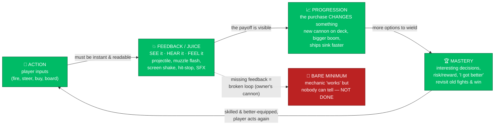

# What Makes It Fun — the definition of fun, from real gamers

> **Owner directive (2026-07-01, verbatim):** _"I feel like the studio sometimes delivers just
> bare minimum in functionality... Battle with real guns yes it says so but there are no visuals of
> cannons. This is the fun of it. When I purchase a cannon I want to see some changes, some progress.
> That's the joy of playing a progressive game. Make sure the studio culture prioritises fun &
> working. And get the definition of fun from gamer comments and reviews online... Research research
> research, no one should go lazy and focus on fast delivery. Goal is not fast delivery, but fun!!!
> WE ARE A GAME STUDIO!"_

This is the studio's **design source-of-truth for "fun."** It is not opinion — it is synthesized from
game-designer canon and from what **real gamers say** in reviews, forum threads, and design talks about
the games nearest to Tidewake: arcade **naval/pirate combat** ([Sid Meier's Pirates!](https://en.wikipedia.org/wiki/Sid_Meier's_Pirates!_(2004_video_game)),
[Sea of Thieves](#sources), [AC Black Flag](https://primagames.com/tips/assassins-creed-4-black-flag-naval-combat-guide)),
**progression feel**, **game feel / "juice,"** and what players call **shallow vs. deep**.

Cross-referenced by [`studio/CONSTITUTION.md`](../../studio/CONSTITUTION.md) (FUN & WORKING value),
[`docs/runbook/LOOP.md`](../runbook/LOOP.md) (Definition of Done), and
[`docs/ROADMAP.md`](../ROADMAP.md) (Delivery doctrine). It governs the battle lane
[#135](https://github.com/cakuki/tidewake/issues/135) and every future slice.

---

## The Fun Loop — action → feedback → progression → mastery

Fun is not a feature you add; it is a **loop that closes**. Every player action must produce
**feedback** the player can see/hear/feel; feedback must feed a **progression** the player can
*perceive*; progression must open room for **mastery** — which sends the player back to act again,
now with more skill and more toys. **Break any arrow and the loop leaks fun.** The owner's cannon
complaint is a broken arrow: the *action* (fire) exists, but the *feedback* (visible cannon, muzzle
flash, flying ball, impact) is missing — so the loop never closes.

---

## Top 5 fun-principles for Tidewake (apply these to every slice)

### 1. Every purchase must produce a visible + audible + mechanical change
This is the owner's directive, and gamers back it hard. Players call progression satisfying when the
upgrade is **palpable**: RE4 is "unbeaten in terms of *feeling* the improvement in your weapons";
Dark Souls players describe "the journey from a fragile weakling to a god-slayer"; Metroid's payoff is
"taking out enemies in half the time makes you feel like a badass." The failure mode is real too:
Sea of Thieves progression is widely criticized as "hollow" when rewards are **cosmetic-only and don't
change play**. **Rule for Tidewake:** buy a cannon → you *see* it mounted on the deck, *hear* a
heavier boom, and *feel* enemies sink faster. No purchase is "done" until all three land.

### 2. Show the projectile, sell the hit ("juice")
Juice is "excessive feedback in relation to input" — the oomph that makes an action *matter*. The
canonical techniques (Vlambeer's _Art of Screenshake_; Jonasson & Purho's _Juice It or Lose It_):
**show the projectile in flight** (visible cannonball + trail), **muzzle flash + smoke**, **screen
shake** on fire and on impact, **hit-stop** (a split-second freeze that makes a hit feel powerful),
**impact particles**, and **layered audio** that fires in tandem with the visual. A broadside with no
visible ball, no smoke, no shake, no sound is a spreadsheet, not a battle. **Every combat/interaction
slice must budget its juice as part of the work, not as "polish later."**

### 3. Readability before depth — the player must *understand* the payoff
Depth only reads as fun once the moment is **legible**. Gamers separate _complexity_ (many systems)
from _depth_ (meaningful, masterable choices); a game "feels shallow" when options collapse to one
viable answer or when the player can't tell what their input did. Make the fun **loud and clear
first**: telegraph the wind, the firing arc, the damage, the "you got stronger." A readable simple
system beats an opaque deep one. Load feedback (see #2) is how depth becomes readable.

### 4. A game is a series of interesting decisions
Sid Meier's rule, articulated *on Pirates!* itself: "a game is a series of interesting decisions" — a
choice where the right answer is unclear and multiple considerations pull different ways. Pirates!
endures 20 years on because it's "the pleasure of thinking well, of choosing correctly." For Tidewake's
battle lane [#135](https://github.com/cakuki/tidewake/issues/135): the fun is the **live trade-off** —
close for a raking broadside vs. stay safe; spend the turn reloading grape vs. chain; board for the
capture (Standing) vs. sink for the Infamy. Randomize/vary conditions so each fight demands fresh
judgment. Never a single dominant tactic.

### 5. Coherent fantasy — many modes, one buccaneer
Players love Pirates! because sailing, combat, trade, boarding, and duels feel like **"a coherent
experience of life as a buccaneer rather than a collection of minigames."** Every Tidewake slice must
feed the north-star fantasy (rise from one small boat to feared pirate or respected governor). Juice,
progression, and decisions all serve *that feeling*. A mechanic that works but doesn't deepen the
fantasy is off-target — this is exactly the "working ≠ fun ≠ done" bar in
[`studio/CONSTITUTION.md`](../../studio/CONSTITUTION.md).

---

## The per-slice FUN checklist (the studio applies this before calling a slice done)

Copy this into the slice's Definition-of-Done. A slice is **INCOMPLETE** until every box is honestly
ticked or explicitly N/A with a reason.

- [ ] **SEE it** — the action has visible feedback on screen (projectile in flight, VFX, muzzle
      flash/smoke, the purchased item actually appears/changes on the ship or in the world).
- [ ] **HEAR it** — an audible cue fires with the action (fire, impact, buy-confirm, level-up sting).
- [ ] **FEEL it** — game-feel weight: screen shake / hit-stop / camera kick / haptic-style emphasis
      proportional to the action's significance.
- [ ] **Progression payoff is perceivable** — if the slice touches upgrades/economy, the player can
      *tell the difference* after buying (bigger boom, faster sink, new visible gear). Not cosmetic-only
      unless cosmetics are the explicit point.
- [ ] **Readable** — a first-time player can tell what happened and why (telegraph → action → result).
- [ ] **Interesting decision** — the slice adds or protects a real trade-off; no single dominant answer.
- [ ] **Serves the fantasy** — it makes *being a rising pirate/governor* feel better, not just adds a
      capability.
- [ ] **Working ≠ done** — green tests/playtest gate passed **AND** the fun beat above is present. If
      the mechanic has no visible/audible/felt feedback, it is **rejected as bare-minimum**.

> Reference build for this bar: the battle slices in
> [#135](https://github.com/cakuki/tidewake/issues/135) — a broadside is not done at "damage is
> applied"; it is done at "the player sees the ball fly, hears the boom, feels the shake, and watches
> the enemy list and sink." Save-invariant work like [#80](https://github.com/cakuki/tidewake/issues/80)
> keeps the *working* half honest; this doc keeps the *fun* half honest.

---

## Sources (cited)

**Game feel & juice**
- [Game Juice: Principles and Techniques — Blood Moon Interactive](https://www.bloodmooninteractive.com/articles/juice.html) — juice = immediate visual/audio feedback proportional to input; screen shake, hit-stop, particles, layered audio.
- [Juice it or Lose it — GameJuice / Jonasson & Purho](https://gamejuice.co.uk/resources/juice-it-or-lose-it) — iteratively juicing a block-breaker: particles, screenshake, sound, animation transform feel.
- [Squeezing more juice out of your game design — GameAnalytics](https://www.gameanalytics.com/blog/squeezing-more-juice-out-of-your-game-design) — juicing takes a working game and adds satisfying animation/audio layers.
- [Game feel — Wikipedia](https://en.wikipedia.org/wiki/Game_feel) — Steve Swink: "real-time control of virtual objects in a simulated space, with interactions emphasised by polish"; Vlambeer's _Art of Screenshake_.
- [Designing Game Feel: A Survey (Pichlmair & Johansen), arXiv](https://arxiv.org/pdf/2011.09201) — academic survey of game-feel levers: input, response, context, aesthetic, metaphor, rules.

**Progression that players can feel**
- [What games feature the most satisfying power/weapon upgrades — ResetEra](https://www.resetera.com/threads/what-games-feature-the-most-satisfying-power-weapon-upgrades-and-variety.4057/) — RE4 "unbeaten in *feeling* the improvement"; Dark Souls, Metroid, Ratchet & Clank cited by players.
- [Games with satisfying power progression — ResetEra](https://www.resetera.com/threads/games-with-satisfying-power-progression.215301/) — "the difference in game feel when you become a master is palpable."

**Shallow vs. deep**
- [Depth in games — an in-depth look (Krajzeg / Jakub Wasilewski)](https://medium.com/@krajzeg/depth-in-games-an-in-depth-look-d94a04ce581a) — depth = permutations of masterable mechanics; if options reduce to one viable answer, it isn't deep.
- [What is Game Depth and How to Evaluate It — GameDesignSkills](https://gamedesignskills.com/game-design/game-depth/) — effective complexity (what the player must actually think about) drives depth vs. shallowness.

**Arcade naval / pirate combat**
- [Sid Meier and the Interesting Decision — Bosnan](https://www.bosnan.net/essays/sid-meier) — "a game is a series of interesting decisions," articulated on Pirates!; modes cohere into "life as a buccaneer," not a minigame pile.
- [Sid Meier's Pirates! (2004) — Wikipedia](https://en.wikipedia.org/wiki/Sid_Meier's_Pirates!_(2004_video_game)) — seamless open-world Caribbean blending combat, trade, sailing, duels.
- [AC4 Black Flag Naval Combat Guide — Prima Games](https://primagames.com/tips/assassins-creed-4-black-flag-naval-combat-guide) — broadside targeting, 45° approach, wind/positioning, upgrade priority (hull → cannons → heavy shot → mortars) as the readable decision layer.
